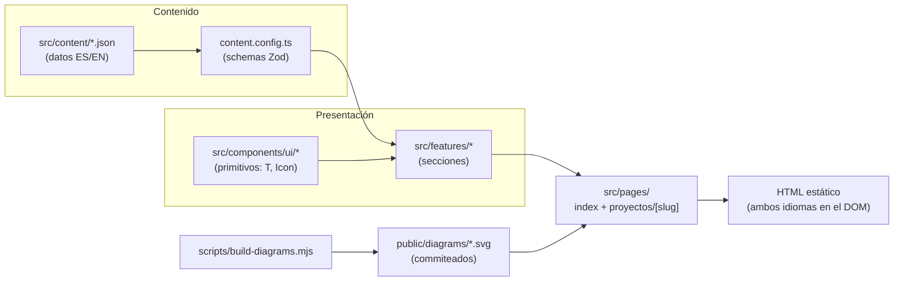
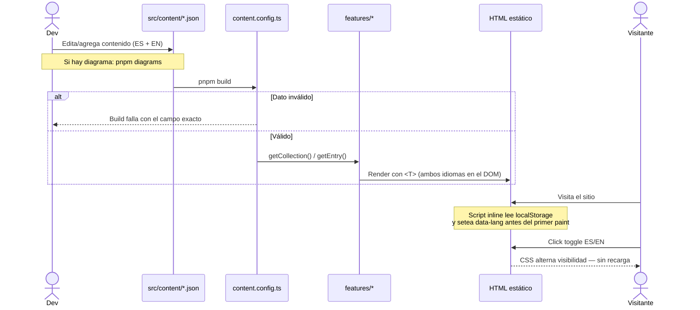

# Portafolio — Carlos Quiroz

> Portafolio personal bilingüe (ES/EN) de desarrollador Full Stack: sitio estático con grid de proyectos y página de detalle por proyecto, orientado a conseguir oportunidades de trabajo y freelance.


---

## 1. Project Overview

Sitio de contenido con interactividad puntual: presentación, stack tecnológico por catálogo, proyectos con detalle individual (arquitectura, decisiones clave y desafíos) y experiencia en doble línea de tiempo. Lo que lo diferencia de un template genérico es que **el contenido y la interfaz están completamente desacoplados**: todo dato visible vive en colecciones JSON validadas con Zod, y el sitio es bilingüe sin duplicar rutas ni recargar la página.

La documentación de decisiones vive en [`docs/DECISIONS.md`](./docs/DECISIONS.md) (10 ADRs — fuente de verdad del proyecto), el sistema de diseño en [`docs/DESIGN.md`](./docs/DESIGN.md) y el contexto de producto en [`docs/CONTEXT.md`](./docs/CONTEXT.md).

---

## 2. Architecture Overview

### Diagram



### Architecture Decisions

Resumen de las decisiones estructurales. El registro completo, con contexto y consecuencias de cada una, está en [`docs/DECISIONS.md`](./docs/DECISIONS.md) — ninguna implementación puede contradecirlo sin actualizarlo primero.

#### ADR-001: Sitio 100% estático, cero JS por defecto

- **Decisión:** Astro 7 con output estático; la interactividad se resuelve con scripts vanilla, sin islands de framework ni SSR.
- **Contexto:** Es un sitio de contenido con interacciones mínimas (toggle de idioma, menú, copiar email), pero un framework de UI cargaría kilobytes de runtime para tres comportamientos triviales.
- **Consecuencias:** Carga instantánea y cero dependencias de servidor; se acepta que cada interacción nueva se escribe a mano como script de responsabilidad única.

#### ADR-002: Content Collections como única fuente de verdad

- **Decisión:** Prohibido hardcodear texto, enlaces o datos en componentes — todo vive en `src/content/` validado con Zod, incluidos los textos del propio UI (colección `ui`).
- **Contexto:** El contenido cambia mucho más seguido que la interfaz, y cada string suelto en un componente es un cambio de código para editar una palabra.
- **Consecuencias:** Editar contenido nunca toca componentes y un campo faltante rompe el build, no la página; a cambio, agregar una sección exige definir schema y datos antes de escribir UI.

#### ADR-003: Bilingüe con ambos idiomas en el DOM, toggle por CSS

- **Decisión:** Cada campo de texto usa el shape `{ es, en }`; ambos idiomas se renderizan en build y un toggle en cliente alterna visibilidad vía `html[data-lang]`, sin recargar.
- **Contexto:** Las rutas i18n de Astro (`/es/`, `/en/`) duplican la estructura por locale y recargan la página al cambiar idioma — un costo alto para un sitio de una página.
- **Consecuencias:** Cambio de idioma instantáneo y datos ya estructurados para migrar a rutas i18n si algún día hace falta; se acepta perder el SEO del idioma secundario y duplicar el HTML de texto.

#### ADR-004: Catálogo centralizado de tecnologías

- **Decisión:** Las tecnologías se modelan como catálogo por categorías en `src/content/stack/`; los proyectos referencian IDs del catálogo, nunca strings libres.
- **Contexto:** La misma tecnología aparece en la sección Stack y en los chips de cada proyecto — dos fuentes divergen en nombre o icono con el tiempo.
- **Consecuencias:** Un ID con typo rompe el build (Zod valida contra el catálogo aplanado) y agregar una tecnología actualiza todas las vistas; el costo es mantener el catálogo como paso previo a usar una tecnología nueva.

#### ADR-006 / ADR-007: Detalle por ruta + diagramas pre-renderizados

- **Decisión:** Cada proyecto tiene página propia (`/proyectos/{slug}`) y su diagrama Mermaid se renderiza a SVG en local (`pnpm diagrams`), commiteando los artefactos.
- **Contexto:** Un modal no da URL compartible ni SEO por proyecto; renderizar Mermaid en cliente carga una librería pesada y hacerlo en el build de Vercel arrastra Chromium para artefactos que solo cambian al editar un diagrama.
- **Consecuencias:** Detalle enlazable con botón atrás nativo y diagramas sin costo en runtime ni en CI; se acepta la regla operativa de regenerar los SVGs antes de commitear cuando cambia un diagrama.

---

## 3. Scope & Boundaries

### En scope

- Página principal estática: header con nav sticky, hero con accesos (GitHub, LinkedIn, CV, copiar email), stack por catálogo, grid de proyectos, experiencia en doble timeline, sección "Sobre mí".
- Página de detalle por proyecto: estado, galería, descripción larga, stack, diagrama de arquitectura, decisiones clave y desafíos.
- Bilingüe ES/EN con toggle instantáneo y persistencia en `localStorage`.
- Validación de contenido en build (Zod): un dato mal formado impide el deploy, no rompe la UI.

### Fuera de scope (MVP)

- Blog (fase futura — Astro lo soporta como colección nueva sin migración).
- SEO del idioma secundario y rutas i18n (`/es/`, `/en/`) — trade-off aceptado en ADR-003.
- Backend, formularios de contacto y analytics avanzados — el contacto ocurre por email/LinkedIn, fuera del sistema.

---

## 4. Tech Stack

| Tecnología                | Versión | Rol                | Por qué                                                                                               |
| ------------------------- | ------- | ------------------ | ----------------------------------------------------------------------------------------------------- |
| Astro                     | 7.x     | Framework estático | Cero JS por defecto, Content Collections con validación Zod integrada                                 |
| Tailwind CSS              | 4.x     | Estilos            | Tokens del design system en `@theme` expuestos como utilidades; color por rol, no por valor           |
| TypeScript                | 5.x     | Tipado             | Tipos derivados de los schemas Zod (`CollectionEntry`) — los errores de contenido se atrapan en build |
| astro-icon + simple-icons | 1.x     | Iconos             | SVG inline tree-shaken en build: cero requests en runtime, coloreable con `currentColor`              |
| @mermaid-js/mermaid-cli   | 11.x    | Diagramas          | Pre-renderiza Mermaid a SVG en local; ni librería en cliente ni Chromium en CI                        |
| pnpm                      | 10.x    | Gestor de paquetes | Instalación estricta y rápida; `node_modules` sin dependencias fantasma                               |
| Vercel                    | —       | Deploy             | CI/CD automático desde `main` para sitios estáticos                                                   |

---

## 5. Project Structure

```
portfolio-web/
├── docs/                    # Fuente de verdad: DECISIONS.md (ADRs), DESIGN.md, CONTEXT.md
├── src/
│   ├── content.config.ts    # Schemas Zod; el helper `localized` define el shape { es, en }
│   ├── content/             # Datos — única fuente de verdad (ADR-002)
│   │   ├── stack/           #  Catálogo de tecnologías por categoría (ADR-004)
│   │   ├── projects/        #  Un JSON por proyecto; el nombre del archivo es el slug
│   │   ├── experience/      #  Entradas laborales y de formación
│   │   └── ui/              #  Textos del propio UI (labels, títulos de sección)
│   ├── features/            # Secciones por dominio; consumen content/ y components/ui/
│   │   └── header/ hero/ stack/ projects/ experience/
│   ├── components/ui/       # Primitivos compartidos (T.astro, Icon.astro) — no conocen el contenido
│   ├── layouts/             # BaseLayout: <head>, script inline de idioma (evita flash)
│   ├── pages/               # index.astro + proyectos/[slug].astro (ADR-006)
│   ├── scripts/             # Cliente vanilla, una responsabilidad por archivo (lang-toggle, hamburger)
│   ├── styles/global.css    # Tokens del design system en @theme (ver docs/DESIGN.md)
│   └── icons/               # SVGs locales para astro-icon (los que no están en simple-icons)
├── scripts/build-diagrams.mjs  # Mermaid → SVG desktop/mobile (pnpm diagrams, ADR-007)
└── public/diagrams/         # SVGs generados y commiteados (artefactos derivados)
```

**Regla de dependencia (ADR-008):** los datos fluyen en una sola dirección — `content/` → `features/` → páginas. `components/ui/` nunca conoce el contenido.

---

## 6. Data Flow

Flujo de un cambio de contenido hasta la pantalla, y del toggle de idioma en runtime:



---

## 7. Setup & Installation

### Requisitos previos

- Node.js >= 20
- pnpm >= 10

### Instalación

```bash
git clone https://github.com/carlosqm-dev/portfolio-carlos.git
cd portfolio-carlos

pnpm install

# Solo si vas a regenerar diagramas: Chrome para Puppeteer (una sola vez)
pnpm exec puppeteer browsers install chrome

pnpm dev
```

### Scripts disponibles

| Comando             | Descripción                                        |
| ------------------- | -------------------------------------------------- |
| `pnpm dev`          | Servidor de desarrollo                             |
| `pnpm build`        | Build estático (valida todo el contenido con Zod)  |
| `pnpm preview`      | Sirve el build de producción                       |
| `pnpm diagrams`     | Regenera los SVGs de Mermaid en `public/diagrams/` |
| `pnpm format`       | Prettier sobre todo el proyecto                    |
| `pnpm format:check` | Verificación de formato sin escribir               |

> No hay test runner: la correctitud del contenido se garantiza en build con Zod (un campo faltante o un ID de tecnología inexistente hacen fallar `pnpm build`).
